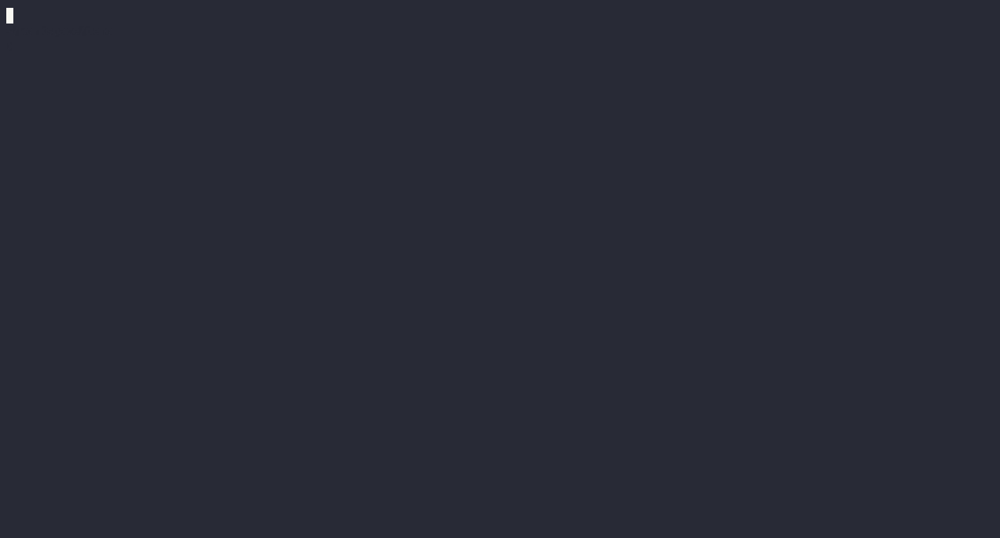

# Distribution Tooling for Helm

`dt`, is a set of utilities available in a standalone mode and as a Helm Plugin for making offline work with Helm charts easier. It is meant to be used for creating reproducible and relocatable packages for Helm charts that can be easily moved across registries without hassles. This is particularly useful for distributing Helm charts into air-gapped environments like those used by Federal governments.

## TL;DR

Distribute your Helm charts with two easy commands

```console
# Wrap 
$ helm dt wrap oci://docker.io/bitnamicharts/kibana
  ...
  🎉  Helm chart wrapped into "/Users/martinpe/workspace/kibana/kibana-10.4.8.wrap.tgz"

# Unwrap
$ helm dt unwrap kibana-10.4.8.wrap.tgz demo.goharbor.io/helm-plugin/ --yes
  ...
  🎉  Helm chart unwrapped successfully: You can use it now by running "helm install oci://demo.goharbor.io/helm-plugin/kibana --generate-name"
```



This tool builds on [HIP-15](https://github.com/helm/community/blob/main/hips/hip-0015.md) and the, currently proposed, [images lock file HIP (PR)](https://github.com/helm/community/pull/281) as a foundation. Hence, it does require Helm charts to contain an annotation that provides the full list of container images that a Helm chart might need for its usage independently of the bootstrapping configuration.

[Bitnami Helm charts](https://github.com/bitnami/charts) are now fully annotated to support this tooling, but you can also use this set of utilities with any other Helm charts that might use any other alternative image listing annotation, like for example, Helm charts relying on [artifact.io/images](https://artifacthub.io/docs/topics/annotations/helm/).

## Installation

### Installing as a Helm plugin

Provided you have [Helm](https://helm.sh) then you can install this tool as a plugin:

```console
$ helm plugin install https://github.com/vmware-labs/distribution-tooling-for-helm
```

### Downloading and using standalone

Fetch the latest available release from the [Releases](https://github.com/vmware-labs/distribution-tooling-for-helm/releases) section.

Note that all the examples below use this tool as a Helm plugin but you can just run it as standalone. Just remove the `helm` command from all those examples.

### Building from Source

You can build this tool with the following command. Golang 1.20 or above is needed to compile. [golangci-lint](https://golangci-lint.run/usage/install/) is used for linting.

```console
$ make build
```

You can also verify the build by running the unit tests:

```console
$ make test
```

## Basic Usage

The following sections list the most common commands and their usage. This tool can be used either standalone or through the Helm plugin.

For the sake of following this guide, let's pull one of the Bitnami Helm charts into an examples folder:

```console
$ git clone git@github.com:vmware-labs/distribution-tooling-for-helm.git
$ cd distribution-tooling-for-helm
$ bash -c "mkdir examples & helm pull oci://docker.io/bitnamicharts/mariadb -d examples --untar" 
```

The two simplest and most powerful commands on this tool are `wrap` and `unwrap`. With these two commands **you can relocate any Helm chart to any OCI registry in two steps**.

### Wrapping Helm charts

Wrapping a chart consists of packaging the chart into a tar.gz, including all container images that this chart depends on, independently of values. Everything gets wrapped together into a single file. This will include also all the subcharts and their container images. That new file, the wrap, can be distributed around in whatever way you want (e.g. USB stick) to then later be unwrapped into a destination OCI registry. This process is commonly referred to as relocating a Helm chart.

Even more exciting, we don't need to download the Helm chart for wrapping it. We can point the tool to any reachable Helm chart and the tool will take care of packaging and downloading everything for us. For example:

```console
$ helm dt wrap oci://docker.io/bitnamicharts/kibana
 »  Wrapping Helm chart "oci://docker.io/bitnamicharts/kibana"
    ✔  Helm chart downloaded to "/var/folders/mn/j41xvgsx7l90_hn0hlwj9p180000gp/T/chart-1177363375/chart-1516625348/kibana"
    ✔  Images.lock file "/var/folders/mn/j41xvgsx7l90_hn0hlwj9p180000gp/T/chart-1177363375/chart-1516625348/kibana/Images.lock" does not exist
    ✔  Images.lock file written to "/var/folders/mn/j41xvgsx7l90_hn0hlwj9p180000gp/T/chart-1177363375/chart-1516625348/kibana/Images.lock"
    »  Pulling images into "/var/folders/mn/j41xvgsx7l90_hn0hlwj9p180000gp/T/chart-1177363375/chart-1516625348/kibana/images"
       ✔  All images pulled successfully
    ✔  Helm chart wrapped to "/Users/martinpe/workspace/kibana/kibana-10.4.8.wrap.tgz"
 🎉  Helm chart wrapped into "/Users/martinpe/workspace/kibana/kibana-10.4.8.wrap.tgz"
```

Note that depending on the number of images needed by the Helm chart (remember, a wrap has the full set of image dependencies, not only the ones set on _values.yaml_) the size of the generated wrap might be considerably large:

```console
$ ls -l kibana-10.4.8.wrap.tgz
-rw-r--r--  1 martinpe  staff  731200979 Aug  4 15:17 kibana-10.4.8.wrap.tgz
```

If you want to make changes on the Helm chart, you can pass a directory to the wrap command. For example, if we wanted to wrap the previously pulled mariadb Helm chart, we could just do:

```console
$ helm dt wrap examples/mariadb/
 »  Wrapping Helm chart "examples/mariadb/"
    ✔  Images.lock file "/Users/martinpe/workspace/distribution-tooling-for-helm/examples/mariadb/Images.lock" does not exist
    ✔  Images.lock file written to "/Users/martinpe/workspace/distribution-tooling-for-helm/examples/mariadb/Images.lock"
    »  Pulling images into "/Users/martinpe/workspace/distribution-tooling-for-helm/examples/mariadb/images"
       ✔  All images pulled successfully
    ✔  Helm chart wrapped to "/Users/martinpe/workspace/distribution-tooling-for-helm/mariadb-13.0.0.wrap.tgz"
 🎉  Helm chart wrapped into "/Users/martinpe/workspace/distribution-tooling-for-helm/mariadb-13.0.0.wrap.tgz"
```

### Unwrapping Helm charts

Unwrapping a Helm chart can be done either to a local folder or to a target OCI registry, being the latter the most powerful option. By unwrapping the Helm chart to a target OCI registry the `dt` tool will unwrap the wrapped file, proceed to push the container images into the target registry that you have specified, relocate the references from the Helm chart to the provided registry and finally push the relocated Helm chart to the registry as well.

At that moment your Helm chart will be ready to be used from the target registry without any dependencies to the source. By default, the tool will run in dry-run mode and require you to confirm actions but you can speed everything up with the `--yes` parameter.

```console
$ helm dt unwrap kibana-10.4.8.wrap.tgz demo.goharbor.io/helm-plugin/ --yes
 »  Unwrapping Helm chart "kibana-10.4.8.wrap.tgz"
    ✔  Helm chart uncompressed to "/var/folders/mn/j41xvgsx7l90_hn0hlwj9p180000gp/T/chart-586072428/at-wrap2428431258"
    ✔  Helm chart relocated successfully
    »  The wrap includes the following 2 images:

       demo.goharbor.io/helm-plugin/bitnami/kibana:8.9.0-debian-11-r9
       demo.goharbor.io/helm-plugin/bitnami/os-shell:11-debian-11-r25

    »  Pushing Images
       ✔  All images pushed successfully
       ✔  Chart "/var/folders/mn/j41xvgsx7l90_hn0hlwj9p180000gp/T/chart-586072428/at-wrap2428431258" lock is valid

    ⠋ Pushing Helm chart "/var/folders/mn/j41xvgsx7l90_hn0hlwj9p180000gp/T/chart-586072428/at-wrap2428431258" to "oci://demo.goharbor.io/helm-plugin/" (0    ⠙ Pushing Helm chart "/var/folders/mn/j41xvgsx7l90_hn0hlwj9p180000gp/T/chart-586072428/at-wrap2428431258" to "oci://demo.goharbor.io/helm-plugin/" (0    ⠹ Pushing Helm chart "/var/folders/mn/j41xvgsx7l90_hn0hlwj9p180000gp/T/chart-586072428/at-wrap2428431258" to "oci://demo.goharbor.io/helm-plugin/" (0    ⠸ Pushing Helm chart "/var/folders/mn/j41xvgsx7l90_hn0hlwj9p180000gp/T/chart-586072428/at-wrap2428431258" to "oci://demo.goharbor.io/helm-plugin/" (1    ⠼ Pushing Helm chart "/var/folders/mn/j41xvgsx7l90_hn0hlwj9p180000gp/T/chart-586072428/at-wrap2428431258" to "oci://demo.goharbor.io/helm-plugin/" (1    ⠴ Pushing Helm chart "/var/folders/mn/j41xvgsx7l90_hn0hlwj9p180000gp/T/chart-586072428/at-wrap2428431258" to "oci://demo.goharbor.io/helm-plugin/" (1    ⠦ Pushing Helm chart "/var/folders/mn/j41xvgsx7l90_hn0hlwj9p180000gp/T/chart-586072428/at-wrap2428431258" to "oci://demo.goharbor.io/helm-plugin/" (1    ⠧ Pushing Helm chart "/var/folders/mn/j41xvgsx7l90_hn0hlwj9p180000gp/T/chart-586072428/at-wrap2428431258" to "oci://demo.goharbor.io/helm-plugin/" (1    ⠇ Pushing Helm chart "/var/folders/mn/j41xvgsx7l90_hn0hlwj9p180000gp/T/chart-586072428/at-wrap2428431258" to "oci://demo.goharbor.io/helm-plugin/" (2    ⠏ Pushing Helm chart "/var/folders/mn/j41xvgsx7l90_hn0hlwj9p180000gp/T/chart-586072428/at-wrap2428431258" to "oci://demo.goharbor.io/helm-plugin/" (2    ✔  Helm chart successfully pushed

 🎉  Helm chart unwrapped successfully: You can use it now by running "helm install oci://demo.goharbor.io/helm-plugin/kibana --generate-name"
```

## Advanced Usage

That was all as per the basic most basic and powerful usage. If you're interested in some other additional goodies then we will dig next into some specific finer-grained commands.

### Creating an images lock

An images lock file, a.k.a. `Images.lock` is a new file that gets created inside the directory as per [this HIP submission](https://github.com/helm/community/pull/281) to Helm community. The `Images.lock` file contains the list of all the container images annotated within a Helm chart's `Chart.yaml` manifest, including also all the images from its subchart dependencies. Along with the images, some other metadata useful for automating processing and relocation is also added.

So, for example, the mariadb Helm chart that we downloaded earlier, has an `images` annotation like this:

```console
$ cat examples/mariadb/Chart.yaml | head -n 10
```

```yaml
annotations:
    category: Database
    images: |
        - image: docker.io/bitnami/mariadb:11.0.2-debian-11-r2
          name: mariadb
        - image: docker.io/bitnami/mysqld-exporter:0.15.0-debian-11-r5
          name: mysqld-exporter
        - image: docker.io/bitnami/os-shell:11-debian-11-r22
          name: os-shell
    licenses: Apache-2.0
```

We can run the following command to create the `Images.lock` for the above Helm chart:

```console
$ helm dt images lock examples/mariadb
INFO[0005] Images.lock file written to "/Users/martinpe/workspace/distribution-tooling-for-helm/examples/mariadb/Images.lock"
```

And it should look similar to this:

```console
$ cat examples/mariadb/Images.lock
```

```yaml
apiVersion: v0
kind: ImagesLock
metadata:
  generatedAt: "2023-08-04T13:36:09.398772Z"
  generatedBy: Distribution Tooling for Helm
chart:
  name: mariadb
  version: 13.0.0
images:
  - name: mariadb
    image: docker.io/bitnami/mariadb:11.0.2-debian-11-r2
    chart: mariadb
    digests:
      - digest: sha256:d3006a4d980d82a28f433ae7af316c698738ba29a5a598d527751cb9139ab7ff
        arch: linux/amd64
      - digest: sha256:3ec78b7c97020ca2340189b75eba4a92ccb0d858ee62dd89c6a9826fb20048c9
        arch: linux/arm64
  - name: mysqld-exporter
    image: docker.io/bitnami/mysqld-exporter:0.15.0-debian-11-r5
    chart: mariadb
    digests:
      - digest: sha256:6f257cc719f5bbde118c15ad610dc27d773f80216adabf10e315fbcaff078615
        arch: linux/amd64
      - digest: sha256:e0c141706fd1ce9ec5276627ae53994343ec2719aba606c1dc228f9290698fc1
        arch: linux/arm64
  - name: os-shell
    image: docker.io/bitnami/os-shell:11-debian-11-r22
    chart: mariadb
    digests:
      - digest: sha256:7082ebf5644cf4968ac635986ded132dd308c0b9c13138f093834f343cd47d7b
        arch: linux/amd64
      - digest: sha256:232ca2da59e508978543c8b113675c239a581938c88cbfa1ff17e9b6e504dc1a
        arch: linux/arm64
```

By default `Images.lock` creation expects an `images` annotation in your Helm chart. However, this can be overridden by the `annotations-key` flag. This is useful for example when dealing with Helm charts that rely on a different annotation like `artifacthub.io/images` which has existed for a while. You can use this flag with most of the commands in this guide.

```console
$ helm dt images lock ../charts/jenkins --annotations-key artifacthub.io/images
```

### Targetting specific architectures

The above `lock` command can be constrained to specific architectures. This is pretty useful to create lighter wraps as many of the images will be dropped when wrapping.

```console
$ helm dt images lock ../charts/jenkins --platform linux/amd64
```

If we now look at generated `Images.lock` we will notice that it contains only `linux/amd64` digests:

```yaml
apiVersion: v0
kind: ImagesLock
metadata:
  generatedAt: "2023-08-04T14:24:18.515082Z"
  generatedBy: Distribution Tooling for Helm
chart:
  name: mariadb
  version: 13.0.0
images:
  - name: mariadb
    image: docker.io/bitnami/mariadb:11.0.2-debian-11-r2
    chart: mariadb
    digests:
      - digest: sha256:d3006a4d980d82a28f433ae7af316c698738ba29a5a598d527751cb9139ab7ff
        arch: linux/amd64
  - name: mysqld-exporter
    image: docker.io/bitnami/mysqld-exporter:0.15.0-debian-11-r5
    chart: mariadb
    digests:
      - digest: sha256:6f257cc719f5bbde118c15ad610dc27d773f80216adabf10e315fbcaff078615
        arch: linux/amd64
  - name: os-shell
    image: docker.io/bitnami/os-shell:11-debian-11-r22
    chart: mariadb
    digests:
      - digest: sha256:7082ebf5644cf4968ac635986ded132dd308c0b9c13138f093834f343cd47d7b
        arch: linux/amd64
```

### Verifying an images lock

The `verify` command can be used to validate the integrity of an `Images.lock` file in a given Helm chart. This command will try to validate that all upstream container images that will be pulled from the Helm chart match actually the image digests that exist in the actual lock file.

With this command, you can make sure that when you distribute a Helm chart with its corresponding `Images.lock` then any customer will be able to validate that just exactly the images defined in the lock will be pulled. Note that this is exactly part of what the `unwrap` command does, to make sure that only exactly what was wrapped gets into the target registry. Signing and other types of provenance are out of the scope of this tool for the time being and need to be added manually with external tooling. This is an area that we are very eager to improve soon.

```console
$ helm dt images verify examples/mariadb
INFO[0004] Helm chart "examples/mariadb" lock is valid
```

### Pulling Helm chart images

Based on the `Images.lock` file, this command downloads all listed images into the `images/` subfolder.

```console
$ helm dt images pull examples/mariadb
INFO[0000] Pulling images into "/Users/martinpe/workspace/distribution-tooling-for-helm/examples/mariadb/images"
INFO[0022] All images pulled successfully
INFO[0022] Success
```

Then, in the `images` folder we should have something like

```console
$ ls -1 examples/mariadb/images
232ca2da59e508978543c8b113675c239a581938c88cbfa1ff17e9b6e504dc1a.tar
3ec78b7c97020ca2340189b75eba4a92ccb0d858ee62dd89c6a9826fb20048c9.tar
6f257cc719f5bbde118c15ad610dc27d773f80216adabf10e315fbcaff078615.tar
7082ebf5644cf4968ac635986ded132dd308c0b9c13138f093834f343cd47d7b.tar
d3006a4d980d82a28f433ae7af316c698738ba29a5a598d527751cb9139ab7ff.tar
e0c141706fd1ce9ec5276627ae53994343ec2719aba606c1dc228f9290698fc1.tar
```

### Relocating a chart

This command will relocate a Helm chart rewriting the `Images.lock` and all of its subchart dependencies locks as well. Additionally, it will change the `Chart.yaml` annotations, and any images used inside `values.yaml` (and all those on subchart dependencies as well).

For example

```console
$ helm dt charts relocate examples/mariadb acme.com/federal
INFO[0000] Helm chart relocated successfully
```

And we can check that references have indeed changed:

```console
$ cat examples/mariadb/Images.lock |grep image
```

```yaml
images:
    image: acme.com/federal/bitnami/mariadb:11.0.2-debian-11-r2
    image: acme.com/federal/bitnami/mysqld-exporter:0.15.0-debian-11-r5
    image: acme.com/federal/bitnami/os-shell:11-debian-11-r22
```

### Pushing images

Based on the `Images.lock` file, this command pushes all images (that must have been previously pulled into the `images/` folder) into their respective registries. Note that this command does not relocate anything. It will simply try to push the images to wherever they are pointing.

Obviously, this command only makes sense when used after having pulled the images and executed the `relocate` command.

```console
# .. should have pulled images first ..
# .. then relocate to a target registry ..
# and now...
$ helm dt images push examples/mariadb
INFO[0033] All images pushed successfully
```

### Getting information about a wrapped chart

It is sometimes useful to obtain information about a wrapped chart before unwrapping it. For this purpose, you can use the info command:

```console
$ helm dt info wordpress-16.1.24.wrap.tgz
 »  Wrap Information
       Chart: wordpress
       Version: 16.1.24
    »  Metadata
          - generatedBy: Distribution Tooling for Helm
          - generatedAt: 2023-08-18T12:52:55.824345304Z
    »  Images
          docker.io/bitnami/apache-exporter:0.13.4-debian-11-r12 (linux/amd64, linux/arm64)
          docker.io/bitnami/bitnami-shell:11-debian-11-r132 (linux/amd64, linux/arm64)
          docker.io/bitnami/wordpress:6.2.2-debian-11-r26 (linux/amd64, linux/arm64)
          docker.io/bitnami/bitnami-shell:11-debian-11-r123 (linux/amd64, linux/arm64)
          docker.io/bitnami/mariadb:10.11.4-debian-11-r0 (linux/amd64, linux/arm64)
          docker.io/bitnami/mysqld-exporter:0.14.0-debian-11-r125 (linux/amd64, linux/arm64)
          docker.io/bitnami/bitnami-shell:11-debian-11-r130 (linux/amd64, linux/arm64)
          docker.io/bitnami/memcached:1.6.21-debian-11-r4 (linux/amd64, linux/arm64)
          docker.io/bitnami/memcached-exporter:0.13.0-debian-11-r8 (linux/amd64, linux/arm64)
```

If you are interested in getting the image digests, you can use the `--detailed` flag:

```console
$ helm dt info --detailed wordpress-16.1.24.wrap.tgz
 »  Wrap Information
       Chart: wordpress
       Version: 16.1.24
    »  Metadata
          - generatedBy: Distribution Tooling for Helm
          - generatedAt: 2023-08-18T12:52:55.824345304Z
    »  Images
       »  wordpress/apache-exporter
             Image: docker.io/bitnami/apache-exporter:0.13.4-debian-11-r12
             Digests
             - Arch: linux/amd64
               Digest: sha256:0b4373c3571d5640320b68f8d296c0a4eaf7704947214640b77528bb4d79d23c
             - Arch: linux/arm64
               Digest: sha256:895ba569e4db3188798e445fe3be2e4da89fd85cb8ae0c5ef0bd2a67cfe4305c
...
       »  mariadb/bitnami-shell
             Image: docker.io/bitnami/bitnami-shell:11-debian-11-r123
             Digests
             - Arch: linux/amd64
               Digest: sha256:13d8883d4f40612e8a231c5d9fa8c4efa74d2a62f0a1991f20fc32c5debdd2b1
             - Arch: linux/arm64
               Digest: sha256:74579dc63b3ae7d8ec21a6ffcd47d16781582fef8dd5a28e77844fcbcb1072c1
...
```

It is also possible to get a YAML dump if the `Images.lock` in case you need to feed it to another process:

```console
$ helm dt info --yaml wordpress-16.1.24.wrap.tgz
```

```yaml
apiVersion: v0
kind: ImagesLock
metadata:
  generatedAt: "2023-08-18T12:52:55.824345304Z"
  generatedBy: Distribution Tooling for Helm
chart:
  name: wordpress
  version: 16.1.24
images:
  - name: apache-exporter
    image: docker.io/bitnami/apache-exporter:0.13.4-debian-11-r12
    chart: wordpress
    digests:
      - digest: sha256:0b4373c3571d5640320b68f8d296c0a4eaf7704947214640b77528bb4d79d23c
        arch: linux/amd64
      - digest: sha256:895ba569e4db3188798e445fe3be2e4da89fd85cb8ae0c5ef0bd2a67cfe4305c
        arch: linux/arm64
...
```

### Annotating a chart (EXPERIMENTAL)

`Images.lock` creation relies on the existence of the special images annotation inside `Chart.yaml`. If you have a Helm chart that does not contain any annotations, this command can be used to guess and generate an annotation with a tentative list of images. It's important to note that this list is a **best-effort** as the list of images is obtained from the `values.yaml` file and this is always an unreliable, often incomplete, and error-prone source as the configuration in `values.yaml` is very variable.

```console
$ helm dt chart annotate examples/mariadb
INFO[0000] Helm chart annotated successfully
```

## Frequently Asked Questions

### I cannot install the plugin due to `Error: Unable to update repository: exit status 1`

This can happen when somehow the plugin process installation or removal breaks and the Helm plugin's cache gets corrupted. Try removing the plugin from the cache and reinstalling it. For example on MAC OSX it would be:

```console
$ rm -rf $HOME/Library/Caches/helm/plugins/https-github.com-vmware-labs-distribution-tooling-for-helm
$ helm plugin install https://github.com/vmware-labs/distribution-tooling-for-helm
```

### How does this project relate to the [relok8s](https://github.com/vmware-tanzu/asset-relocation-tool-for-kubernetes)? Does it replace it?

Good question. Both projects come from VMware and should be able to continue using [relok8s](https://github.com/vmware-tanzu/asset-relocation-tool-for-kubernetes) if you want to. Although, our expectation is to gradually build more and more tooling around the [HIP-15](https://github.com/helm/community/blob/main/hips/hip-0015.md) proposal as it does have a substantial number of benefits when compared to the relocation approach followed by relok8s.

So as the community adopts this new proposal and this plugin becomes more mature we would suggest anyone using relok8s to move its platform scripts to start using this helm plugin. We expect this move to be pretty much straightforward, and actually a great simplification for anyone using relok8s or even chart-syncer.

### What about chart-syncer? Will it continue to work?

Yes, still support [chart-syncer](https://github.com/bitnami-labs/charts-syncer) and we don't have any short-term plans right now about it. But as this tool gains adoption, it becomes natural to think that it should be fairly straightforward to implement Helm chart syncing on top of it.
